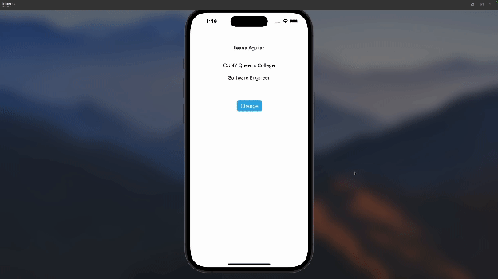

# ios101_prework

## Video Walkthrough:

Here's a walkthrough of implemented features:

GIF created with Adobe  

## List of my favorite apps:
- Instagram
- Youtube
- Amazon
- Spotify

## Features that make them my favorite:

Instagram
- Customizeable message screen
- Change from day mode to night mode

Youtube
- Autoplay video and scroll through video when viewing list of videos
- Playlist 
- Change from day mode to night mode

Amazon
- Reviews 
- Recommends based on passed purchases
- Ar view of products

Spotify
- AI dj
- Overview of year of listening (Wrapped)
- Personalized playlists
- Podcasts, music and audiobooks all in one place

## App Brainstorm:
Think of an app idea that you would like to build. It can be a new idea or an improvement on an existing app. 

Write a short paragraph describing the app and the features you would like to implement. You are not commiting to this idea, but it helps to start brain storming early on and get feedback from your peers and instructors.

### Travel Agent app:
The app will ask the user a series of questions. Based on user's answers, the app will generate a travel interary of things to do. The app will ask a series of questions like "where do you want to travel?", "how long would you like the trip to be?" "What are your interesets?" "Are you a picky eater?", etc. By using the series of answers from user, chatgpt's api can be used to prompt it to generate a travel interiary with a picture of the destination. The app will show a preview of travel interary. User can view and accept. Accepted interarys will be saved on user's account. User can edit saved interarys as they wish.

